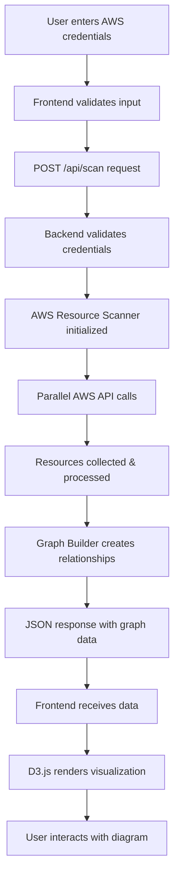

# 🏗️ AWS Infrastructure Visualizer - Project Understanding

## 📋 Table of Contents
1. [Project Overview](#project-overview)
2. [Architecture & Design](#architecture--design)
3. [Technology Stack](#technology-stack)
4. [Project Structure](#project-structure)
5. [Data Flow](#data-flow)
6. [Key Components](#key-components)
7. [AWS Resource Discovery](#aws-resource-discovery)
8. [Graph Visualization Engine](#graph-visualization-engine)
9. [Development Workflow](#development-workflow)
10. [Security Considerations](#security-considerations)
11. [Performance & Scalability](#performance--scalability)
12. [Troubleshooting Guide](#troubleshooting-guide)

---

## 🎯 Project Overview

### Purpose
The AWS Infrastructure Visualizer is a full-stack web application that connects to AWS accounts using temporary credentials and generates interactive, hierarchical visualizations of cloud infrastructure resources using D3.js.

### Core Value Proposition
- **Security-First**: Uses temporary credentials only, never stores sensitive data
- **Comprehensive Discovery**: Scans 14+ AWS service types including EKS, EC2, S3, RDS, Lambda, VPC components
- **Intelligent Relationships**: Automatically discovers and maps resource dependencies
- **Interactive Visualization**: Hierarchical layout with filtering, zoom, pan, and detailed tooltips
- **Production-Ready**: Containerized deployment with health checks and monitoring

### Target Users
- **DevOps Engineers**: Understand infrastructure topology and dependencies
- **Cloud Architects**: Visualize multi-service architectures
- **Security Teams**: Audit resource relationships and network topology
- **Developers**: Understand how their applications fit into the broader infrastructure

---

## 🏗 Architecture & Design

### High-Level Architecture
```
┌─────────────────────┐    ┌─────────────────────┐    ┌─────────────────────┐
│   React Frontend    │    │   Express Backend   │    │   AWS Services      │
│   (Port 3000)       │────│   (Port 3001)       │────│   (Various APIs)    │
│                     │    │                     │    │                     │
│ • D3.js Visualization   │    │ • AWS SDK v3        │    │ • EC2, S3, RDS      │
│ • Interactive Controls  │    │ • Resource Scanner   │    │ • EKS, Lambda       │
│ • Filtering System      │    │ • Graph Builder     │    │ • VPC, IAM          │
└─────────────────────┘    └─────────────────────┘    └─────────────────────┘
```

### Design Patterns

#### 1. **Monorepo with Workspaces**
- **Pattern**: Modular monorepo with shared types
- **Benefits**: Code reuse, consistent types across frontend/backend
- **Implementation**: npm workspaces with `client/`, `server/`, `shared/`

#### 2. **Layered Architecture (Backend)**
```
┌─────────────────────┐
│      Routes         │  ← Express route handlers
├─────────────────────┤
│     Services        │  ← Business logic (AWS scanning, graph building)
├─────────────────────┤
│   AWS SDK Clients  │  ← External service integration
└─────────────────────┘
```

#### 3. **Component-Based Architecture (Frontend)**
```
┌─────────────────────┐
│      App.tsx        │  ← Main application container
├─────────────────────┤
│    Components       │  ← CredentialsForm, NetworkVisualization
├─────────────────────┤
│     Services        │  ← API client, utility functions
└─────────────────────┘
```

#### 4. **Factory Pattern (AWS Clients)**
- **Purpose**: Consistent client creation across AWS services
- **Implementation**: Centralized credential configuration in `AwsResourceScanner`

#### 5. **Builder Pattern (Graph Construction)**
- **Purpose**: Complex graph structure assembly
- **Implementation**: `GraphBuilder` class with step-by-step node/link creation

#### 6. **Observer Pattern (D3 Interactions)**
- **Purpose**: Event-driven UI updates
- **Implementation**: D3 event handlers for zoom, drag, hover, click

---

## 🛠 Technology Stack

### Frontend
| Technology | Version | Purpose |
|------------|---------|---------|
| **React** | 18.2.0 | Component-based UI framework |
| **TypeScript** | 5.3.0 | Type safety and developer experience |
| **D3.js** | 7.8.5 | Data visualization and interactive graphics |
| **Vite** | 4.5.0 | Fast development server and build tool |
| **Axios** | 1.6.0 | HTTP client for API communication |

### Backend
| Technology | Version | Purpose |
|------------|---------|---------|
| **Node.js** | 18+ | Runtime environment |
| **Express.js** | 4.18.2 | Web framework and API server |
| **AWS SDK v3** | 3.454.0+ | AWS service integration |
| **TypeScript** | 5.3.0 | Type safety and developer experience |
| **tsx** | 4.6.0 | TypeScript execution for development |

### Infrastructure & Deployment
| Technology | Purpose |
|------------|---------|
| **Docker** | Containerization and deployment |
| **Docker Compose** | Local development orchestration |
| **Helmet** | Security headers and protection |
| **CORS** | Cross-origin resource sharing |
| **Compression** | Response compression |

### AWS Services Integrated
| Service | SDK Client | Resources Discovered |
|---------|------------|---------------------|
| **EC2** | `@aws-sdk/client-ec2` | Instances, VPCs, Subnets, Security Groups, Volumes, Gateways |
| **EKS** | `@aws-sdk/client-eks` | Clusters, Nodegroups, Fargate Profiles |
| **S3** | `@aws-sdk/client-s3` | Buckets (region-filtered) |
| **RDS** | `@aws-sdk/client-rds` | Database instances |
| **Lambda** | `@aws-sdk/client-lambda` | Functions |
| **IAM** | `@aws-sdk/client-iam` | Roles |
| **ELB** | `@aws-sdk/client-elastic-load-balancing-v2` | Load balancers |

---

## 📁 Project Structure

```
aws-viz/
├── 📁 client/                          # React frontend application
│   ├── 📁 public/                      # Static assets
│   │   └── vite.svg                    # Application icon
│   ├── 📁 src/
│   │   ├── 📁 components/              # React components
│   │   │   ├── CredentialsForm.tsx     # AWS credential input form
│   │   │   └── NetworkVisualization.tsx # D3.js visualization component
│   │   ├── 📁 services/                # API and utility services
│   │   │   └── api.ts                  # Backend API client
│   │   ├── App.tsx                     # Main application component
│   │   ├── main.tsx                    # React application entry point
│   │   └── index.css                   # Global styles
│   ├── index.html                      # HTML template
│   ├── package.json                    # Frontend dependencies
│   ├── tsconfig.json                   # TypeScript configuration
│   └── vite.config.ts                  # Vite build configuration
│
├── 📁 server/                          # Express backend application
│   ├── 📁 src/
│   │   ├── 📁 routes/                  # API route handlers
│   │   │   └── scan.ts                 # /scan and /regions endpoints
│   │   ├── 📁 services/                # Business logic services
│   │   │   ├── aws-scanner.ts          # AWS resource discovery engine
│   │   │   └── graph-builder.ts        # Graph data structure builder
│   │   └── index.ts                    # Express server entry point
│   ├── package.json                    # Backend dependencies
│   └── tsconfig.json                   # TypeScript configuration
│
├── 📁 shared/                          # Shared TypeScript definitions
│   └── types.ts                        # Common interfaces and enums
│
├── 📁 scripts/                         # Development and deployment scripts
│   ├── setup.sh                       # Project setup automation
│   └── health-check.sh                 # Application health verification
│
├── 📄 Configuration Files
├── package.json                        # Root workspace configuration
├── Dockerfile                          # Multi-stage production build
├── docker-compose.yml                  # Container orchestration
├── .dockerignore                       # Docker build exclusions
└── README.md                           # Project documentation
```

### Key Directory Purposes

#### `/client` - Frontend Application
- **Purpose**: User interface and visualization
- **Responsibilities**: Credential input, D3.js rendering, user interactions
- **Build Output**: Static files served by backend in production

#### `/server` - Backend API
- **Purpose**: AWS integration and data processing
- **Responsibilities**: AWS API calls, resource discovery, graph generation
- **Runtime**: Node.js with Express.js

#### `/shared` - Common Definitions
- **Purpose**: Type safety across frontend/backend
- **Contents**: TypeScript interfaces, enums, type definitions
- **Import Pattern**: Relative imports due to monorepo structure

---

## 🔄 Data Flow

### Complete Request Lifecycle



### Detailed Flow Steps

#### 1. **Credential Input (Frontend)**
```typescript
// User fills form in CredentialsForm.tsx
const credentials: AwsCredentials = {
  accessKeyId: "AKIA...",
  secretAccessKey: "...",
  sessionToken: "...", // optional
  region: "ap-south-1"
};
```

#### 2. **API Request (Frontend → Backend)**
```typescript
// api.ts sends POST request
const response = await apiClient.post<ScanResponse>('/scan', {
  credentials
});
```

#### 3. **AWS Resource Discovery (Backend)**
```typescript
// aws-scanner.ts performs parallel scanning
const resources = await Promise.allSettled([
  this.scanEC2Instances(),
  this.scanEKSClusters(),
  this.scanS3Buckets(),
  // ... 14 total scan methods
]);
```

#### 4. **Graph Construction (Backend)**
```typescript
// graph-builder.ts creates visualization data
const graphData: GraphData = {
  nodes: resources.map(r => createNode(r)),
  links: discoverRelationships(resources),
  metadata: { /* stats and counts */ }
};
```

#### 5. **Visualization Rendering (Frontend)**
```typescript
// NetworkVisualization.tsx uses D3.js
const svg = d3.select(svgRef.current);
const nodes = svg.selectAll('.node').data(filteredNodes);
const links = svg.selectAll('.link').data(filteredLinks);
```

---

## 🔧 Key Components

### Backend Components

#### `AwsResourceScanner` (Core Discovery Engine)
```typescript
class AwsResourceScanner {
  // Purpose: Discover all AWS resources in a region
  // Pattern: Factory pattern for AWS clients
  // Parallelization: Promise.allSettled for performance
  
  async scanAllResources(): Promise<AwsResource[]> {
    // Scans 14+ AWS service types in parallel
    // Handles errors gracefully per service
    // Returns unified resource array
  }
}
```

**Key Methods:**
- `scanEC2Instances()` - Discovers EC2 instances with metadata
- `scanEKSClusters()` - Finds EKS clusters, nodegroups, Fargate profiles
- `scanVpcs()`, `scanSubnets()` - Network topology discovery
- `scanS3Buckets()` - Storage resources (region-filtered)

#### `GraphBuilder` (Relationship Engine)
```typescript
class GraphBuilder {
  // Purpose: Convert AWS resources into graph structure
  // Pattern: Builder pattern for complex object construction
  // Intelligence: Automatic relationship discovery
  
  buildGraph(resources: AwsResource[], region: string): GraphData {
    // Creates nodes with hierarchical layers (1-5)
    // Discovers relationships between resources
    // Generates visualization-ready data structure
  }
}
```

**Relationship Discovery Logic:**
- **VPC Containment**: VPC → Subnets → EC2 Instances
- **EKS Hierarchy**: Cluster → Nodegroups/Fargate → EC2 Instances
- **Security Groups**: Associated with instances and load balancers
- **IAM Roles**: Linked to EC2 instances and Lambda functions
- **Load Balancers**: Connected to target instances/services

### Frontend Components

#### `NetworkVisualization` (D3.js Engine)
```typescript
const NetworkVisualization: React.FC = ({ data }) => {
  // Purpose: Interactive infrastructure visualization
  // Technology: D3.js with React integration
  // Layout: Hierarchical 5-layer architecture
  
  useEffect(() => {
    // Creates SVG with zoom/pan capabilities
    // Renders nodes in hierarchical layers
    // Draws relationship lines between resources
    // Adds interactive controls and filters
  }, [data, filters]);
}
```

**Visualization Features:**
- **Hierarchical Layout**: 5 infrastructure layers with automatic positioning
- **Interactive Controls**: Zoom, pan, drag nodes
- **Filtering System**: Layer toggles, service type filters
- **Rich Tooltips**: Resource-specific metadata on hover
- **Detail Panels**: Comprehensive information on click

#### `CredentialsForm` (Security Interface)
```typescript
const CredentialsForm: React.FC = ({ onScan, isLoading }) => {
  // Purpose: Secure AWS credential collection
  // Security: Input validation, no storage
  // UX: Region selection, loading states
  
  const handleSubmit = (credentials: AwsCredentials) => {
    // Validates required fields
    // Triggers AWS infrastructure scan
    // Handles loading and error states
  };
}
```

---

## 🔍 AWS Resource Discovery

### Discovery Strategy

#### 1. **Parallel Scanning**
```typescript
// All AWS services scanned simultaneously for performance
const [vpcs, instances, clusters, buckets] = await Promise.allSettled([
  this.scanVpcs(),
  this.scanEC2Instances(), 
  this.scanEKSClusters(),
  this.scanS3Buckets()
]);
```

#### 2. **Error Resilience**
- Each service scan is isolated
- Failed scans don't break entire discovery
- Graceful degradation with warnings
- Partial results still visualized

#### 3. **Resource Enrichment**
```typescript
// Each resource gets comprehensive metadata
const resource: AwsResource = {
  id: instance.InstanceId,
  name: getResourceName(instance.Tags) || instance.InstanceId,
  type: ResourceType.EC2_INSTANCE,
  region: this.region,
  arn: constructArn(instance),
  vpcId: instance.VpcId,
  subnetId: instance.SubnetId,
  tags: parseTags(instance.Tags),
  metadata: {
    instanceType: instance.InstanceType,
    state: instance.State?.Name,
    securityGroupIds: instance.SecurityGroups?.map(sg => sg.GroupId),
    // ... extensive metadata
  }
};
```

### EKS-Specific Discovery

#### EKS Cluster Scanning
```typescript
async scanEKSClusters(): Promise<AwsResource[]> {
  // 1. List all clusters in region
  // 2. Describe each cluster for full metadata
  // 3. Extract VPC/subnet configuration
  // 4. Capture endpoint access settings
}
```

#### Nodegroup Discovery
```typescript
async scanEKSNodegroups(): Promise<AwsResource[]> {
  // 1. For each cluster, list nodegroups
  // 2. Describe nodegroup configuration
  // 3. Capture instance types, scaling config
  // 4. Link to parent cluster
}
```

#### Relationship Mapping
```typescript
// EKS Cluster → Nodegroups
eksNodegroups.forEach(nodegroup => {
  const clusterName = nodegroup.metadata.clusterName;
  const cluster = clusters.find(c => c.name === clusterName);
  relationships.push({
    sourceId: cluster.id,
    targetId: nodegroup.id,
    type: RelationshipType.MANAGES
  });
});

// Nodegroups → EC2 Instances (via tags)
if (instanceTags['kubernetes.io/cluster/' + clusterName] === 'owned') {
  relationships.push({
    sourceId: nodegroup.id,
    targetId: instance.id,
    type: RelationshipType.RUNS_ON
  });
}
```

---

## 📊 Graph Visualization Engine

### Hierarchical Layout System

#### Infrastructure Layers
```
Layer 1: Gateways (Internet, NAT)           ← Entry points
         ↓
Layer 2: Load Balancers & Routing           ← Traffic distribution  
         ↓
Layer 3: Compute (EC2, Lambda, EKS)         ← Application layer
         ↓
Layer 4: Data (RDS, S3, EBS)               ← Storage & databases
         ↓
Layer 5: Foundation (VPC, Subnets, IAM)     ← Infrastructure base
```

#### D3.js Implementation
```typescript
// Hierarchical positioning algorithm
const layerHeight = height / 6; // 5 layers + padding
layerGroups.forEach((nodes, layer) => {
  const y = layerHeight * (layer - 0.5);
  const nodeSpacing = Math.min(width / (nodes.length + 1), 120);
  
  nodes.forEach((node, index) => {
    node.x = startX + index * nodeSpacing;
    node.y = y;
  });
});
```

### Interactive Features

#### 1. **Zoom and Pan**
```typescript
const zoom = d3.zoom<SVGSVGElement, unknown>()
  .scaleExtent([0.1, 4])
  .on("zoom", (event) => {
    g.attr("transform", event.transform);
  });
```

#### 2. **Filtering System**
```typescript
const [filters, setFilters] = useState<FilterOptions>({
  layers: [1, 2, 3, 4, 5],           // All layers visible
  serviceTypes: Object.values(ResourceType), // All services
  showRelationships: true,            // Show connection lines
  groupByVpc: true                   // VPC-based grouping
});
```

#### 3. **Rich Tooltips**
```typescript
.on("mouseover", (event, d) => {
  setTooltip({
    x: event.pageX + 10,
    y: event.pageY - 10,
    content: formatTooltipContent(d), // Resource-specific details
    visible: true
  });
});
```

### Visual Design System

#### Color Coding
```typescript
const getResourceColor = (type: ResourceType): string => {
  return {
    [ResourceType.EKS_CLUSTER]: '#326CE5',     // Kubernetes blue
    [ResourceType.EC2_INSTANCE]: '#FF6B6B',   // Instance red
    [ResourceType.S3_BUCKET]: '#45B7D1',      // Storage blue
    [ResourceType.VPC]: '#DDA0DD',            // Network purple
    // ... 14 total resource types
  }[type] || '#BDC3C7';
};
```

#### Icon System
```typescript
const getResourceSymbol = (type: ResourceType): string => {
  return {
    [ResourceType.EKS_CLUSTER]: '☸️',         // Kubernetes wheel
    [ResourceType.EKS_NODEGROUP]: '⚙️',       // Worker gear
    [ResourceType.EKS_FARGATE_PROFILE]: '🐳', // Container ship
    [ResourceType.EC2_INSTANCE]: '🖥️',       // Computer
    // ... intuitive emoji mapping
  }[type] || '📦';
};
```

---

## 🔨 Development Workflow

### Local Development Setup

#### 1. **Initial Setup**
```bash
# Clone repository
git clone <repository-url>
cd aws-viz

# Run setup script
chmod +x scripts/setup.sh
./scripts/setup.sh

# Or manual setup
npm run install:all
npm run dev
```

#### 2. **Development Servers**
```bash
# Start both frontend and backend
npm run dev                    # Runs concurrently

# Or individually
npm run dev:client            # Frontend only (port 3000)  
npm run dev:server            # Backend only (port 3001)
```

#### 3. **Health Verification**
```bash
./scripts/health-check.sh     # Comprehensive endpoint testing
curl http://localhost:3001/health  # Backend health
```

### Code Organization Patterns

#### Shared Types Strategy
```typescript
// shared/types.ts - Single source of truth
export interface AwsResource {
  id: string;
  name: string;
  type: ResourceType;
  // ... comprehensive type definitions
}

// Import in both frontend and backend
import { AwsResource } from '../../../shared/types';
```

#### Error Handling Pattern
```typescript
// Backend: Graceful service degradation
results.forEach((result, index) => {
  if (result.status === 'fulfilled') {
    resources.push(...result.value);
  } else {
    console.warn(`Failed to scan resource type ${index}:`, result.reason);
  }
});

// Frontend: User-friendly error display
try {
  const response = await scanAwsInfrastructure(credentials);
  // ... handle success
} catch (error) {
  setState(prev => ({
    ...prev,
    error: error instanceof Error ? error.message : 'Unknown error'
  }));
}
```

### Testing Strategy

#### Health Check Automation
```bash
# scripts/health-check.sh validates:
✅ Server health endpoint (HTTP 200)
✅ Frontend loading (HTTP 200)  
✅ API regions endpoint (HTTP 200)
✅ Scan endpoint error handling (HTTP 400)
```

#### Manual Testing Workflow
1. **Credential Testing**: Use AWS CLI temporary credentials
2. **Region Coverage**: Test multiple AWS regions
3. **Resource Variety**: Verify with different infrastructure setups
4. **Error Scenarios**: Test invalid credentials, network issues
5. **Performance**: Monitor scan times with large resource counts

---

## 🔒 Security Considerations

### Credential Handling

#### Security Model
```
🔐 TEMPORARY CREDENTIALS ONLY
├── ✅ No persistent storage
├── ✅ In-memory processing only  
├── ✅ Session-based lifecycle
├── ✅ Automatic cleanup
└── ❌ No long-term AWS keys
```

#### Best Practices Implementation
```typescript
// 1. Input validation
if (!accessKeyId || !secretAccessKey || !region) {
  return res.status(400).json({
    success: false,
    error: 'Missing required credential fields'
  });
}

// 2. Temporary credential pattern
const awsConfig = {
  region: credentials.region,
  credentials: {
    accessKeyId: credentials.accessKeyId,
    secretAccessKey: credentials.secretAccessKey,
    ...(credentials.sessionToken && { sessionToken: credentials.sessionToken })
  }
};

// 3. No credential logging
console.log(`🔍 Starting scan for region: ${region}`); // ✅ Safe
console.log(`Credentials: ${credentials}`);              // ❌ Never do this
```

### Network Security

#### CORS Configuration
```typescript
app.use(cors({
  origin: process.env.CORS_ORIGIN || 'http://localhost:3000',
  credentials: true,
}));
```

#### Security Headers
```typescript
app.use(helmet({
  contentSecurityPolicy: {
    directives: {
      defaultSrc: ["'self'"],
      styleSrc: ["'self'", "'unsafe-inline'"],
      scriptSrc: ["'self'"],
    },
  },
}));
```

### Container Security

#### Non-Root Execution
```dockerfile
# Create app user for security
RUN addgroup -g 1001 -S nodejs && \
    adduser -S appuser -u 1001

# Switch to app user
USER appuser
```

#### Minimal Attack Surface
```dockerfile
# Multi-stage build removes dev dependencies
FROM node:18-alpine AS production
# Only production artifacts copied
COPY --from=builder --chown=appuser:nodejs /app/server/dist ./dist
```

---

## ⚡ Performance & Scalability

### Backend Performance

#### Parallel AWS API Calls
```typescript
// All 14+ AWS services scanned simultaneously
const results = await Promise.allSettled([
  this.scanVpcs(),           // ~10ms
  this.scanEC2Instances(),   // ~200ms  
  this.scanEKSClusters(),    // ~150ms
  // ... parallel execution
]);
// Total time ≈ slowest_call + overhead (not sum of all calls)
```

#### Memory Management
```typescript
// Streaming approach for large datasets
const instances: AwsResource[] = [];
(response.Reservations || []).forEach(reservation => {
  (reservation.Instances || []).forEach(instance => {
    instances.push(transformInstance(instance));
  });
});
// Avoid loading all data into memory at once
```

### Frontend Performance

#### D3.js Optimization
```typescript
// Efficient data binding and updates
const nodeGroup = g.selectAll('.node')
  .data(filteredNodes, d => d.id)  // Key function for efficient updates
  .join(
    enter => enter.append('g').attr('class', 'node'),
    update => update,
    exit => exit.remove()
  );
```

#### Filtering Performance
```typescript
// Client-side filtering avoids server round trips
const filteredNodes = data.nodes.filter(node => 
  filters.layers.includes(node.layer) && 
  filters.serviceTypes.includes(node.type)
);
// Instant filter updates without re-scanning AWS
```

### Scalability Considerations

#### Resource Count Limits
- **Tested**: Up to 1000+ AWS resources
- **Performance**: Linear degradation with resource count
- **Bottlenecks**: D3.js rendering > AWS API calls > Graph building

#### Memory Usage
```typescript
// Typical memory footprint per resource
const avgResourceSize = 2; // KB (metadata + relationships)
const maxResources = 1000;
const totalMemory = avgResourceSize * maxResources; // ~2MB client-side
```

#### Horizontal Scaling
```yaml
# Docker Compose scaling example
services:
  aws-viz:
    deploy:
      replicas: 3
    # Load balancer required for multiple instances
```

---

## 🔧 Troubleshooting Guide

### Common Issues

#### 1. **"Cannot find module '@aws-sdk/client-eks'"**
```bash
# Solution: Install missing AWS SDK package
cd server
npm install @aws-sdk/client-eks
```

#### 2. **"concurrently: command not found"**
```bash
# Solution: Install concurrently in root workspace
npm install concurrently
```

#### 3. **"EACCES: permission denied" (npm cache)**
```bash
# Solution: Fix npm cache permissions
sudo chown -R $(id -u):$(id -g) ~/.npm
```

#### 4. **Frontend shows blank page**
```bash
# Check for TypeScript import errors
npm run type-check --workspace=client

# Common fix: Shared types import path
# Change: import { Types } from '@/shared/types'
# To:     import { Types } from '../../../shared/types'
```

#### 5. **AWS Credential Errors**
```bash
# Verify credentials work with AWS CLI
aws sts get-caller-identity --region ap-south-1

# Check required permissions
aws ec2 describe-instances --region ap-south-1 --max-items 1
aws eks list-clusters --region ap-south-1
```

### Performance Debugging

#### Slow AWS Scanning
```typescript
// Add timing to identify slow services
console.time('VPC Scan');
const vpcs = await this.scanVpcs();
console.timeEnd('VPC Scan');
```

#### D3.js Rendering Issues
```typescript
// Check for large datasets
console.log(`Rendering ${nodes.length} nodes, ${links.length} links`);

// Performance threshold
if (nodes.length > 500) {
  console.warn('Large dataset may impact rendering performance');
}
```

### Development Debugging

#### Backend Debug Mode
```bash
# Enable detailed AWS SDK logging
export AWS_SDK_JS_SUPPRESS_MAINTENANCE_MODE_MESSAGE=""
export DEBUG=aws-sdk:*
npm run dev:server
```

#### Frontend Debug Mode
```bash
# Enable React development tools
export NODE_ENV=development
npm run dev:client
```

### Production Monitoring

#### Health Check Endpoints
```bash
# Application health
curl http://localhost:3000/health

# Component health
curl http://localhost:3001/api/regions  # Backend API
curl http://localhost:3000             # Frontend serving
```

#### Log Analysis
```bash
# Docker container logs
docker-compose logs aws-viz

# Resource discovery logs
docker-compose logs aws-viz | grep "Discovered.*resources"

# Error tracking
docker-compose logs aws-viz | grep -i error
```

---

## 🎯 Key Takeaways for Developers

### Understanding the Flow
1. **User Input** → **AWS API Calls** → **Graph Construction** → **D3.js Visualization**
2. **Security First**: Temporary credentials, no storage, input validation
3. **Performance**: Parallel AWS scanning, client-side filtering, efficient D3.js updates
4. **Scalability**: Modular architecture, containerized deployment, horizontal scaling ready

### Contributing Guidelines
1. **Types First**: Add shared types before implementation
2. **Error Handling**: Graceful degradation, user-friendly messages
3. **Testing**: Health checks, multiple regions, various resource scenarios
4. **Documentation**: Update this document for architectural changes

### Architecture Decisions
- **Monorepo**: Shared types, coordinated development
- **Hierarchical Layout**: Better than force-directed for infrastructure visualization  
- **Client-Side Filtering**: Instant UI updates, reduced server load
- **AWS SDK v3**: Modern, modular, tree-shakeable
- **Docker**: Consistent deployment, easy scaling

This project demonstrates enterprise-grade full-stack development with real-world AWS integration, security best practices, and interactive data visualization. 